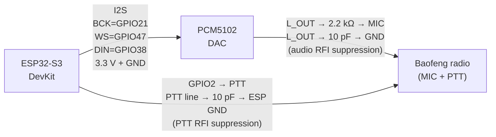

# ESP32-S3 Fox Hunt Voice Beacon

A voice-and-tone beacon for amateur radio direction finding ("fox hunting"), running on an ESP32-S3-DevKitC-1-N16R8. Audio is generated on the ESP32, fed through a PCM5102 I2S DAC, and keyed into a Baofeng (or similar) handheld radio via a simple wired interface. Speech is either generated on-device with [Flite TTS](https://github.com/pschatzmann/arduino-flite) or pre-rendered from a WAV file you supply.

## Hardware

- **Board:** ESP32-S3-DevKitC-1-N16R8 (8 MB PSRAM, 16 MB flash)
- **DAC:** PCM5102 I2S DAC breakout
- **Audio path:** PCM5102 `L_OUT` → 2.2 kΩ series → cable → radio MIC input. A 10 pF cap from `L_OUT` to GND brings RFI on the audio line down to acceptable levels when the radio transmits.
- **PTT:** ESP `GPIO2` → cable → radio PTT line, with a 10 pF cap from the PTT line to GND at the ESP end. Without this cap the PTT triggers erratically when the radio is keyed up (RFI bleeding into the GPIO line).
- **N16R8 caveat:** GPIOs 26–32 (octal SPI flash) and 33–37 (octal SPI PSRAM) are reserved by the module. GPIO35 in particular will trigger an immediate watchdog reset if you try to drive it.

### Block diagram



## Build & flash

PlatformIO project (pioarduino fork of `platform-espressif32`):

```sh
pio run                          # build
pio run --target upload          # flash firmware
pio run --target uploadfs        # flash SPIFFS (speech.raw, etc.)
pio device monitor               # serial @ 115200
```

USB CDC is enabled on boot — you'll need to wait ~2 s after `Serial.begin()` before output is visible.

## Speech sources

Toggled by `#define USE_FLITE` in `src/main.cpp`:

### `USE_FLITE 1` — on-device synthesis

Flite renders the message at boot (~24 s for a multi-word phrase), then caches the result to SPIFFS at `/speech.raw`. Subsequent boots load the cache in milliseconds. Bump `SPEECH_VERSION` to invalidate the cache when you change the message text or `DURATION_STRETCH`. Costs ~3.2 MB of flash for the Flite library + voice.

Speech is split into a `parts[]` array, each rendered separately and concatenated with configurable silence gaps via `concat_wave()`. This is the easiest way to get reliable inter-phrase pauses — Flite's punctuation-driven pauses have a fixed, short duration model.

### `USE_FLITE 0` — pre-generated WAV

Loads `data/speech.raw` from SPIFFS and plays it directly. Flite is excluded from the build, dropping flash usage from ~49 % to ~12 %. Use this when you've rendered speech with a higher-quality TTS and don't need on-device synthesis.

The voice in the shipped `ve1fo-adam.wav` was generated by an online AI voice generator (the "Adam" voice, one of several). The specific service used was retired since, but online AI voice generation is rapidly-evolving — search around and you should easily find a current one that lets you paste your own text.

Convert any WAV (any bit depth, mono/stereo, PCM or IEEE float) to the cache format:

```sh
python3 scripts/wav2speech.py input.wav [-v VERSION] [-r SAMPLE_RATE] [-o OUTPUT]
```

Defaults: `--version 12`, `--resample 16000`, `--output data/speech.raw`. Then upload SPIFFS:

```sh
pio run --target uploadfs
```

## Tuning knobs

- **`SPEECH_GAIN`** — applied in-memory to PCM samples after load, with int16 clipping protection. Doesn't require re-synthesis.
- **`DURATION_STRETCH`** — Flite phoneme duration scale (USE_FLITE=1 only). >1.0 = slower. Requires bumping `SPEECH_VERSION`.

## Cache format

`data/speech.raw` (SPIFFS):
- 16-byte header: 4 little-endian int32 — `[version, sample_rate, num_samples, num_channels]`
- Body: raw int16 PCM samples

## LED status (built-in RGB)

| Color | Meaning |
|-------|---------|
| Red blink | Synthesizing (Flite mode, cache miss) |
| Blue blink | Loading cached speech from SPIFFS |
| Green blink | Waiting between playback cycles |
| Off | Playing audio |

LED runs on Core 0 with a mutex-protected state variable. Brightness 50 %.

## Why it ended up this way (design history)

A few decisions in the code only make sense once you know what didn't work — keeping them here so they don't get re-litigated.

### Why two 10 pF caps instead of switching the audio path
The original problem was RFI from the Baofeng's transmitter coupling into the audio line and the PTT line when the radio keyed up. Two simple 10 pF bypass caps to GND (one at the DAC's `L_OUT`, one on the PTT line at the ESP end) solved both issues with no signal-path changes. That's why the I2S/PCM5102 path is the documented build — it sounds clean once the RFI is bypassed.

### PWM mode (abandoned, code retained as `OUTPUT_PWM`)
Before the bypass-cap fix landed, an alternate PWM output path was built on the assumption that the PCM5102 DAC was the RFI culprit. It works, but the audio quality through 8-bit PWM at 156 kHz wasn't good enough for FM voice — speech was intelligible but harsh. Once the bypass caps fixed the actual RFI, PWM was abandoned. The `#define OUTPUT_PWM` toggle still exists in `src/main.cpp` for anyone who wants to revisit it.

A few details from that detour are still worth knowing:

- The arduino-audio-tools `PWMAudioOutput` class is broken on ESP-IDF 5.x (pioarduino). Its `esp_timer_create()` call leaves the ISR dispatch field uninitialized and returns `ESP_ERR_INVALID_ARG` (258). The custom `SimplePWMAudio` class in this project uses ESP32 LEDC directly to dodge that.
- The toggle is `OUTPUT_PWM`, *not* `USE_PWM`. arduino-audio-tools defines `USE_PWM` internally in `PlatformConfig/esp32.h` for all ESP32 targets, so a user-side `#define USE_PWM` was already-defined by the time `#ifdef USE_PWM` was evaluated — silent collision with no compiler warning. Renamed to `OUTPUT_PWM` so the toggle actually toggles.
- In PWM mode, tones are square waves generated by direct GPIO toggling rather than 8-bit PWM samples — detach LEDC, toggle pin, re-attach. Cleaner output than running tones through the PWM path.

### SPIFFS caching
Flite synthesis takes ~24 s for a multi-word phrase. Re-doing that on every reset gets old fast. We allocate sample buffers in PSRAM (`ps_malloc`) and persist to SPIFFS with a version-stamped header, then short-circuit synthesis when the cached version matches.

### Custom partition table (`partitions_custom.csv`)
Default ESP32-S3 partition layout caps app at ~6.5 MB; the Flite-included build hits ~7 MB. Switched to `app3M_fat9M_16MB`-style layout to leave room for the binary + a 9 MB SPIFFS partition for cached speech.

### Stack overflow → audio noise
Earlier debugging of "loud noise after speech" chased volume muting, silence flushing, and I2S start/stop bracketing — none fixed it. The actual cause was a 10 KB task stack overflowing during Flite's deeply-recursive synthesis path on multi-word phrases; the overflow corrupted adjacent memory and surfaced as audible noise. Tripled the stack to 30 KB.

### `board_build.filesystem = spiffs`
pioarduino defaults to LittleFS, but this project uses SPIFFS. Without the explicit setting, `pio run --target uploadfs` fails with `mklittlefs: command not found`.

## Layout

```
src/main.cpp           Single-file design — boot, synth/load, tone+speech loop
data/speech.raw        Pre-generated speech (USE_FLITE=0) or cached output (USE_FLITE=1)
scripts/wav2speech.py  WAV → speech.raw converter
partitions_custom.csv  Custom 16 MB partition layout
platformio.ini         Build config
CLAUDE.md              Full architecture notes (for AI-assisted edits)
```

## Key libraries

- [arduino-audio-tools](https://github.com/pschatzmann/arduino-audio-tools) — I2S streaming
- [arduino-flite](https://github.com/pschatzmann/arduino-flite) — Flite TTS (cmu_us_slt voice, ~3.2 MB)
- Adafruit NeoPixel — onboard RGB LED
